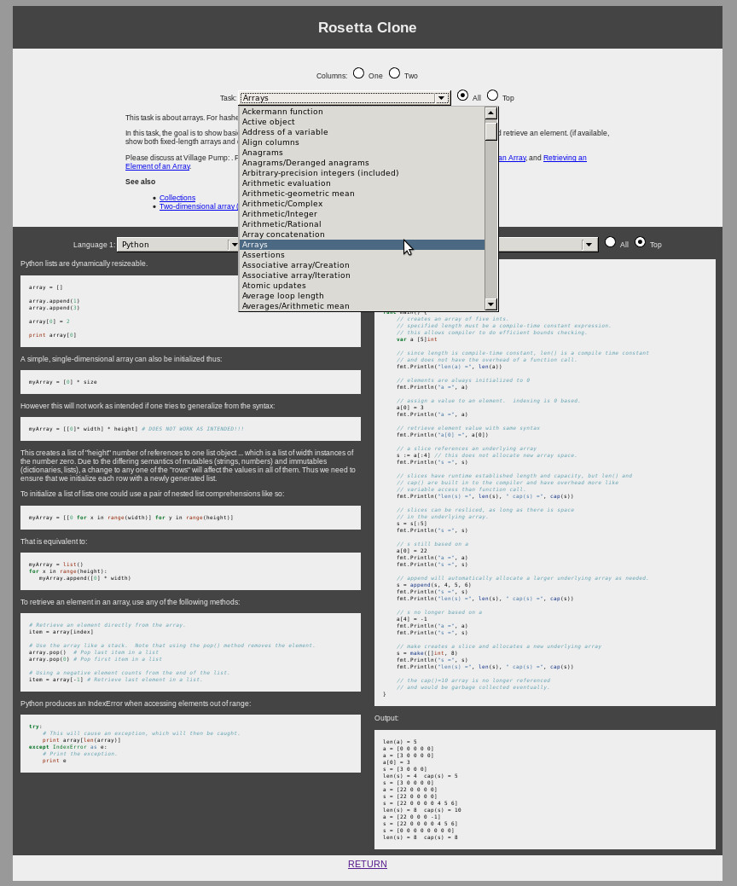

Rosetta Clone
=============

Improved UI for browsing the [Rosetta Code](http://www.rosettacode.org) website.

To be hosted [here](http://www.rosettaclone.org) (use AWS).

Screenshot:  

TODO:
-----

- Improve markdown parsing
- upload to AWS
- Statistics page
- About page
- FAQ page
- Add more/better filters
- Tidy up code (MVC)
- configuration script (for downloading and parsing database)
- Unit tests
- Make website "responsive" (i.e. javascript) 

####XXX:
- Parsing does not handle templates
- Parser confused by "twin" headers (eg =={{header|C}} / {{header|C++}}== )
- Forward slashes in tasks must be removed
- Better initialisation 
